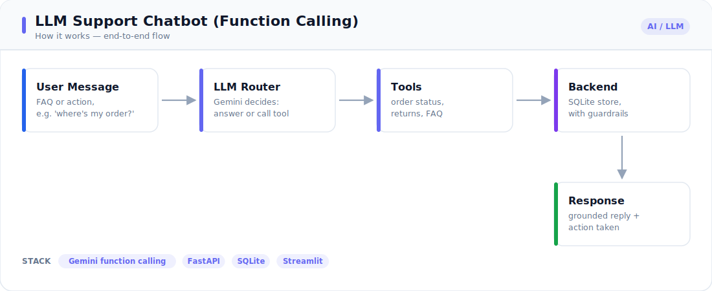

# 🛍️ LLM Customer-Support Chatbot with Function Calling

A support assistant for a fictional tea & coffee store that **answers FAQs and takes real actions** — checking order status, listing a customer's orders, starting returns, and looking up products — by calling functions against a SQLite backend. Includes conversation memory and identity guardrails.

> This is the "LLM that actually *does* things" pattern clients ask for: not just chat, but tool-use against your systems, safely.

---

<!-- portfolio-visuals -->

## 🔧 How it works



*End-to-end flow from input to output — see [`architecture.svg`](./architecture.svg).*

---


## What it does / who it's for

Most support volume is repetitive: *"Where's my order?"*, *"How do I return this?"*, *"Is X in stock?"*. This bot resolves those end-to-end by combining natural-language understanding with **function calling** into a real (mock) backend — deflecting tickets while staying safe (a customer can only see their own data).

## Key capabilities (what it proves)

- **Function calling loop:** the model chooses a tool, the app executes it, the result is fed back, and the model replies — fully orchestrated.
- **Real actions, not just answers:** `get_order_status`, `list_my_orders`, `start_return`, **`cancel_order`**, `get_product_info`, `get_return_policy`, **`escalate_to_human`** against SQLite.
- **Conversation memory:** identity captured once is reused across turns.
- **Human-handoff guardrail:** a deterministic detector escalates to a human — opening a priority-tagged **support ticket** — when the customer asks for an agent, shows frustration, or the bot's tools fail repeatedly. Knowing when *not* to answer is a production-grade safety behaviour. See `src/escalation.py`.
- **Guardrails:** personal-data tools require a verified email; cross-account access is blocked; returns enforce the policy window; **cancellations are refused once an order has shipped** (state-machine guard).
- **Pluggable provider:** Google **Gemini** native function calling in production; a deterministic **offline mock** router for tests/CI/demos (no key).
- **Production-ready:** structured logging of every tool call (`LOG_LEVEL`), `Dockerfile` + `docker-compose.yml`, GitHub Actions CI.
- **Two interfaces:** FastAPI `/chat` (per-session memory) and a Streamlit chat UI.

## Demo

Real transcript (offline mock provider):

```text
USER: Hi! My email is alice@example.com
BOT : Thanks — I've verified your account (alice@example.com)...

USER: What's the status of ORD-1002?
BOT : Order ORD-1002 is shipped (1x SKU-KET, ETA 2026-06-30).      [tool: get_order_status]

USER: List my orders
BOT : Here are your orders:
      - ORD-1002: shipped (SKU-KET)
      - ORD-1001: delivered (SKU-TEA)                              [tool: list_my_orders]

USER: I'd like to return ORD-1001 because it arrived damaged
BOT : Your return RET-6F68C9 for ORD-1001 has been requested...    [tool: start_return]

USER: What's your return policy?
BOT : Items can be returned within 30 days of delivery...          [tool: get_return_policy]
```

**Guardrail in action** — a customer can't read another account's order:

```text
USER: my email is bob@example.com
USER: status of ORD-1002          (this order belongs to Alice)
BOT : This order belongs to a different account.
```

**API:**

```bash
curl -X POST http://localhost:8000/chat \
  -H "Content-Type: application/json" \
  -d '{"session_id": "s1", "message": "status of ORD-1003, my email is bob@example.com"}'
```

## How it works

```
user turn ─► capture identity (email) ─► [agent loop, ≤ MAX_TOOL_STEPS]
                                              │
                                  provider.step(transcript)
                                       │            │
                                  tool_call?    text answer ──► reply
                                       │
                              execute_tool() ──► append result ──► loop again
```

The provider only decides *what to do next*; the agent executes tools and keeps the transcript (memory). Swapping `mock` ↔ `gemini` changes nothing else.

## Tech stack

- **API:** FastAPI, Uvicorn, Pydantic
- **Backend:** SQLite (customers / products / orders / returns)
- **LLM:** Google Gemini function calling (`google-generativeai`), pluggable
- **UI:** Streamlit chat
- **Observability:** structured logging via `src/logging_utils.py` (`LOG_LEVEL` env, per-tool-call logs)
- **Deploy:** `Dockerfile` + `docker-compose.yml`; GitHub Actions CI runs the suite
- **Tests:** pytest (28 tests covering tools, guardrails, cancellation state guards, the agent loop, and human-handoff escalation)

## Setup & run

```bash
cd 04-llm-support-chatbot
python -m venv .venv && source .venv/bin/activate   # Windows: .venv\Scripts\activate
pip install -r requirements.txt
cp .env.example .env                                 # works offline, no key needed

python -m src.generate_data     # seed the mock store DB
uvicorn api:app --reload        # API at http://localhost:8000/docs
streamlit run app.py            # chat UI
pytest -q
```

Enable Gemini in `.env`: `LLM_PROVIDER=gemini` and `GEMINI_API_KEY=...`.

## Project structure

```
04-llm-support-chatbot/
├── api.py                  # FastAPI /chat with per-session memory
├── app.py                  # Streamlit chat UI
├── src/
│   ├── config.py           # settings from .env
│   ├── database.py         # SQLite schema + connection
│   ├── generate_data.py    # seed customers/products/orders
│   ├── tools.py            # callable tools (incl. cancel_order) + JSON schemas + guardrails
│   ├── guardrails.py       # identity capture, input hygiene
│   ├── llm_provider.py     # Gemini function calling + offline mock router
│   ├── logging_utils.py    # structured logging + timing
│   ├── agent.py            # function-calling loop + conversation memory
│   └── escalation.py       # human-handoff detector (request / frustration / failures)
├── tests/                  # 28 pytest tests
├── Dockerfile              # containerised FastAPI service
├── docker-compose.yml
├── .github/workflows/ci.yml
├── requirements.txt
├── .env.example
└── .gitignore
```

## Possible extensions

- **RAG over a help center** for open-ended FAQs (combine with project 01).
- **Sentiment-model handoff** to complement the rule-based escalation already built in.
- **Auth** via real session tokens / OTP instead of email capture.
- **More tools:** address changes, cancellations, refunds, shipment tracking webhooks.
- **Analytics:** deflection rate, tool success rate, escalation reasons.
